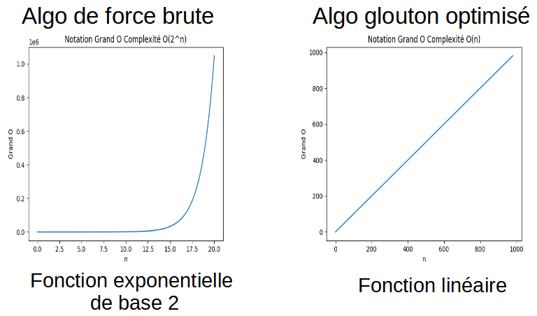

# AlgoInvest v1

**_Projet réalisé lors de ma formation de Développeur d'application Python à OpenClassrooms_**

_**AlgoInvest est un programme d'analyse de dataset d'actions dont le but est de constituer le portefeuille d'actions maximisant les bénéfices**_

## Le code

* Il y a deux codes avec deux algorithmes:
1. bruteforce.py (algo de force brute)
2. optimized.py (algo type glouton dit problème du sac à dos)

## Installation et utilisation

* Hypothèse: python min 3.9.1 déjà installé

* Le code n'utilise que la bibliothèque standard de python

* Créer nouveau répertoire et copier les fichiers bruteforce.py, optimized.py et le répertoire data

* Dans le fichier de code, indiquer
	* le dataset à utiliser à la ligne data_csv='data/dataset_20_actions.csv'
	* le montant max à investir à la ligne MAX_INVEST = 500

* Ouvrir un terminal powershell et en fonction de l'ago à utiliser saisir une des commandes:
	* `python bruteforce.py`
	* `python optimized.py`

* Les résultat s'affichera dans le terminal avec les champs suivants:
	* len_dispo_stock_list
	* bigO
	* len_can_buy_stock_list (pour l'algo de force brute seulement)
	* best_stock_list
	* best_stock_list_price
	* best_stock_list_profit
	* len_best_stock_list
	* duration in s

_**En plus du code, vous trouverez les documents:**_

1. analyse_bruteforce.txt (Algo force brute)
2. pseudo_code.txt (Algo type glouton dit problème du sac à dos)
3. présentation_algoinvest.pdf (Analyse des algorithmes)
